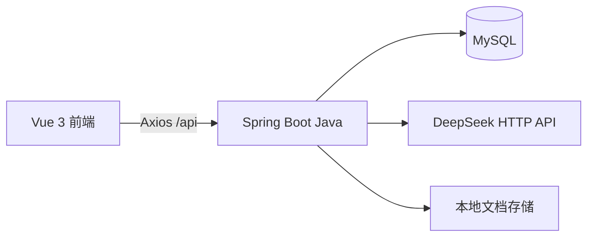
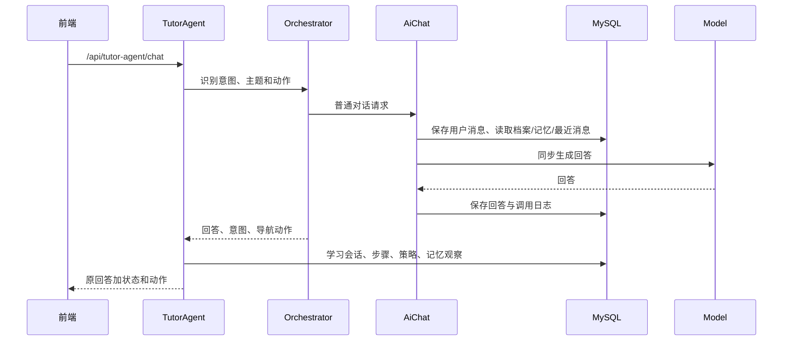

# 当前架构

## 组件

前端开发服务器由 Vite 提供，`/api` 代理到后端 8080。浏览器只访问 Java；当前没有 Python 服务、向量数据库、Redis、消息队列或容器编排文件。

## 认证与边界

注册和登录为公开接口，其余业务接口由 JWT 拦截器和用户上下文保护，管理员能力在服务层再次校验。响应统一为 `{code,message,data}`，业务异常通常由统一处理器写入业务 `code`，不要仅凭 HTTP 状态判断成功。

## 普通教师请求

策略和知识图谱上下文是在回答生成后计算的，因此它们会被记录并返回，但不会影响本次已经生成的回答。这是当前实现事实，也是教学闭环的主要改进点。

## 其他流程

- 练习生成分为持久化题目和临时 AI 练习；临时练习不会写入题目表。
- RAG 上传文档、解析、分片并写入 MySQL；检索只在用户自己的已完成文档中进行，按关键词得分取前几段，再调用模型回答。
- 个人图谱提取使用 `@Async` 线程池，按批次生成节点和关系；上传后可自动创建提取任务，客户端轮询状态，发布是显式操作。
- 学习计划和 Agent 建议主要由规则与已有学习数据生成；它们没有独立的计划表或自动执行器。

## 一致性与故障边界

教师主链路处于事务中，模型调用失败可能导致同一事务内的消息、日志和学习步骤一起回滚；当前没有持久化消息队列或启动恢复。个人图谱处理中的任务没有外部队列，进程中断后不会自动恢复。文档上传和图谱自动提取耦合，超过限制或并发时需要客户端按状态处理。

## 未来演进约束

Python 适合承载模型编排、检索和评测，但 Java 应继续拥有认证、文档所有权、业务事务、最终写入和对外 API。任何新服务都必须有超时、单次重试、降级路径和请求关联 ID；在单 Agent 价值未被评测前不引入 Multi-Agent。
